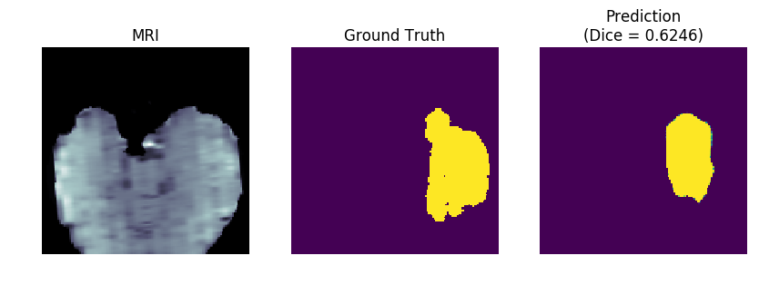
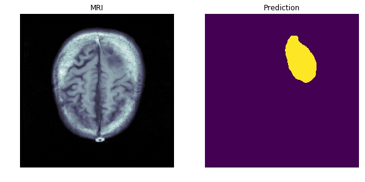

# MRI_methylation
predicting methylation status in glioblastoma patients using convolutional neural networks

Follow these steps to train to segmentation model to isolate tumours in the t1 modality of an MRI scan and use the results of that model to train a classification model to predict the mathylation status of glioblastoma patients

Steps:
1. Download the TCGA data for methylation in the gene MGMT in brain cancer patients from the National Cancer Institute Portal http://bit.ly/2RYyDHR into the Methylation/data directory

2. Go to the [Medical Segmentation Decathlon](http://medicaldecathlon.com) website and download the [BraTS subset] (https://drive.google.com/file/d/1A2IU8Sgea1h3fYLpYtFb2v7NYdMjvEhU/view?usp=sharing) into the Brats/data directory. The dataset has the [Creative Commons Attribution-ShareAlike 4.0 International license](https://creativecommons.org/licenses/by-sa/4.0/)

3. Explore TCGA-GBM data-set with exploratory_analysis.ipynb

4. Explore BRATS data-set with segmentation_unet_explore.ipynb

5. Train Brats Segmentation Model with U-Net backbone with segmentation_unet_explore.ipynb. 
Credit to this wonderful repository for making this happen so seamlessly --> https://github.com/IntelAI/unet/tree/master/2D

Example Output from Segmentation Model

6. Train Methylation Model with ResNet-50 backbone with methylation_training.ipynb

Example Output from Segmentation Model

